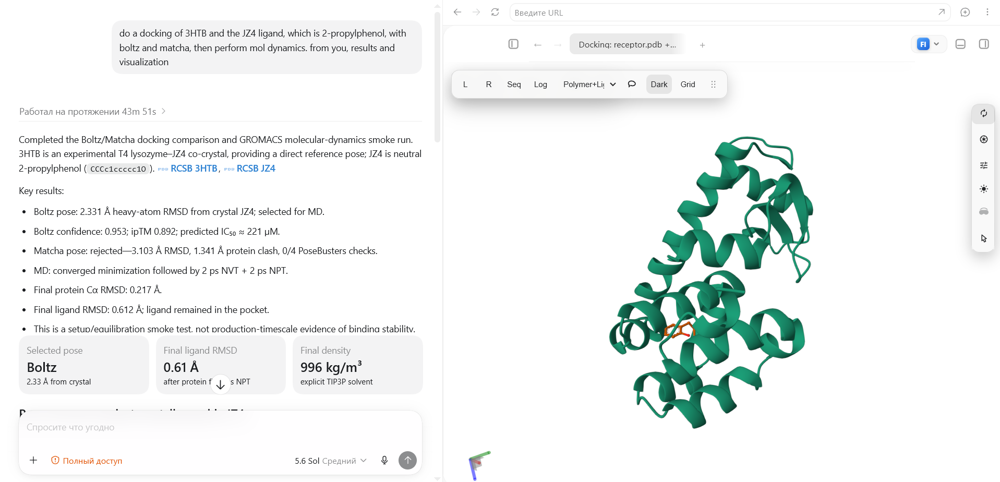
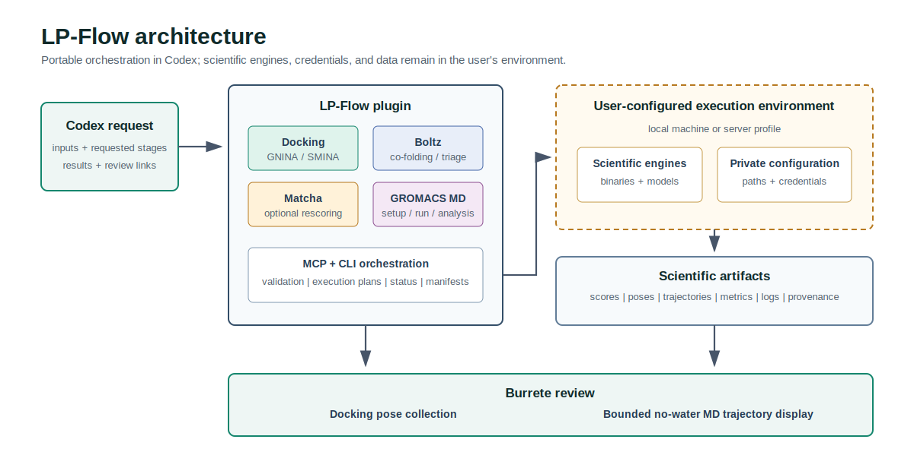

# LP-Flow

**A Codex plugin for staged molecular workflows: docking, co-folding, optional
rescoring, molecular dynamics, and interactive result review.**

[](https://github.com/akutabaka/lp-flow/actions/workflows/ci.yml)
[](https://github.com/akutabaka/lp-flow/releases)
[](LICENSE)



## What Is LP-Flow?

LP-Flow is a reusable Codex MCP/CLI plugin for protein-ligand docking,
Boltz co-folding and confidence triage, optional Matcha rescoring, and
GROMACS molecular dynamics. It validates inputs, produces staged run packages,
preserves manifests and scientific artifacts, and hands pose or trajectory
packages to [Burrete](https://github.com/SergeiNikolenko/Burrete) for review.

The plugin does not bundle scientific engines, credentials, model weights,
private profiles, or user data. Those remain in the user's execution
environment and task workspace.

## Architecture



Docking, Boltz, and Matcha are distinct calculation lanes rather than a fixed
linear chain. LP-Flow validates each requested lane, runs it through the user's
configured environment, records method-specific status and artifacts, and
passes selected poses or MD display trajectories to Burrete.

## Quick Start

LP-Flow requires Node.js 20+ and a Codex host. Create a local marketplace using
the exact layout in [Installation](docs/installation.md), install LP-Flow, and
start a new Codex session.

Verify the source entrypoint before or after installation:

```bash
node scripts/lp-flow.mjs status
node scripts/lp-flow.mjs list-tools
```

## Capabilities

| Lane | What LP-Flow prepares or runs |
| --- | --- |
| Docking | GNINA/SMINA docking, redocking, rescoring, pose packages, and summaries |
| Co-folding | Boltz-2 complex prediction, confidence ranking, and affinity triage |
| Rescoring | Optional Matcha scoring when its runtime, checkpoints, and parser are configured |
| Dynamics | GROMACS EM/NVT/NPT or explicitly requested production workflows, cleanup, and metrics |
| Review | Burrete pose collections and trajectory handoff with recorded open/status evidence |

## Burrete Integration

Burrete is an external molecular workspace. LP-Flow prepares receptor/pose and
trajectory display packages, requests the Burrete handoff, and records its link
or exact unavailable status. A static PNG is a report thumbnail, not completed
interactive visualization. If Burrete is unavailable, LP-Flow preserves the
scientific package and records visualization separately from scientific method
status.

## Documentation

- [Installation](docs/installation.md)
- [Quickstart](docs/quickstart.md)
- [Architecture](docs/architecture.md)
- [MCP and CLI surface](docs/mcp-as-cli.md)
- [MD protocols](docs/md-protocols.md)
- [Profiles](docs/profiles.md)
- [Golden prompts](docs/golden-prompts.md)
- [Security policy](SECURITY.md)

The automated suite covers public MCP contracts, skills, golden prompts,
non-destructive execution smoke behavior, source hygiene, and extracted release
packages. Run it from the plugin root with:

```bash
npm test
```

## License

LP-Flow is released under the [MIT License](LICENSE). Third-party tools,
models, checkpoints, and external services retain their own terms; see
[THIRD_PARTY_NOTICES.md](THIRD_PARTY_NOTICES.md).
